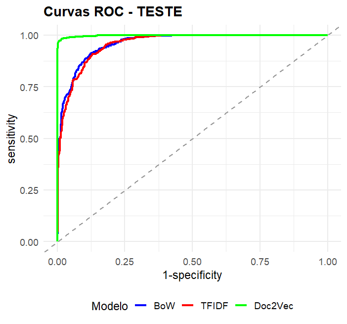

## **Organização da apresentação** {.scrollable}

::: box-blue
-   Motivação e Objetivos
-   Construção da Base de Dados
    -   Textos Humanos
    -   Textos Gerados por IA
-   Pré-processamento Textual
-   Métodos de Vetorização
    -   Bag of Words
    -   TF-IDF
    -   doc2vec
-   Classificação com XGBoost
-   Resultados
-   Conclusões
-   Próximos passos
:::

## **Motivação e Objetivos** {.scrollable}

-   O crescimento das IAs generativas;
-   Aumento no plágio e textos gerados integralmente por IAs;
-   Desenvolver um classificador capaz de detectar introduções de TCCs geradas por IAs na língua portuguesa;

## **Construção da Base de Dados** {.scrollable}

1.  Foi elaborado um script com os pacotes *`httr`* e `rvest`, de forma a acessar automaticamente o repositório institucional da UFF e baixar os arquivos em PDF das monografias publicadas antes de 2023.

2.  Foram baixados TCCs dos seguintes cursos: Estatística, Licenciatura em Matemática, Ciências Sociais, Medicina, áreas das Engenharias, Direito, Ciência da Computação, Geografia, Enfermagem, Turismo, Pedagogia, Licenciatura em Física e Licenciatura em Educação Física.

3.  A partir dos arquivos PDF, foram extraídos os titulos e as introduções das monografias.

4.  Utilizou-se um modelo de linguagem (Llama 3.1 8B), via API da Groq, para gerar introduções artificiais a partir do seguinte comando:

    “Escreva uma introdução para um trabalho de conclusão de curso de graduação no curso \[i\], cujo título do trabalho é título\[i\]. A introdução gerada deve conter entre 80% e 120% do número de caracteres do texto\[i\], considerando os espaços na contagem de caracteres. Não inclua, na sua resposta, o caractere \# e o \*.”

5.  A base final, com **6330 linhas — cada linha referente a um TCC —**, foi dividida em conjuntos de treino e teste.

## Base de dados

| Variávies | Tipo | Descrição | Observação |
|------------------|------------------|------------------|------------------|
| Rótulos | Qualitativa | 1, se o texto foi gerado por IA e 0 se foi gerado por humano | 3165 rótuloss iguais a 1 (IA) e 3165 rótuloss iguais a 0 (humanos) |
| Introdução | Texto | A introdução de uma monografia | Livre |
| Título | Texto | O título da monografia | Livre |
| Curso | Qualitativa | O curso para qual a monografia foi escrita | 19 diferentes categorias de cursos |

## Exemplos dos Textos {.smaller .scrollable}

**Título do TCC:**\
#RUIRESISTE: UMA REFLEXÃO CRÍTICA SOBRE EDUCAÇÃO A PARTIR DA MANIFESTAÇÃO POLÍTICA PELA PERMANÊNCIA DA MUNICIPALIZAÇÃO DO ENSINO MÉDIO NA CIDADE DE CABO FRIO EM 2017

**Curso:** Ciências Sociais

::: panel-tabset
## Humano

“Somente quando os oprimidos descobrem, nitidamente, o opressor, e se engajam na luta organizada por sua libertação, começam a crer em si mesmos, superando, assim, sua “conivência” com o regime opressor.” (Paulo Freire – Pedagogia do Oprimido)

Neste presente artigo monográfico proponho analisar as consequências de uma escola pública municipal de Ensino Médio que prioriza em seu Projeto Político Pedagógico o pensamento crítico e reflexivo na formação dos seus alunos e alunas. A escola em questão é o Colégio Municipal Rui Barbosa (CMRB) localizado na cidade de Cabo Frio no estado do Rio de Janeiro, e que ano de 2017 se organizou politicamente a fim de impedir a estadualização das escolas públicas municipais da cidade que assim como ela, ofereciam o Ensino Médio.

Pensar questões como essa é trazer para a superfície uma possibilidade concreta de transformação social que visa confrontar diretamente a desigualdade socioeducacional existente no país. Enquanto ex-aluno do Colégio Municipal Rui Barbosa trago também para este trabalho a minha experiência nos anos que lá estudei em diálogo com a minha prática artística profissional, uma relação de afeto e construção política que valoriza e endossa a importância de uma formação escolar básica ‘contestadora de mundo”.

No campo acadêmico, o artigo aposta num adensamento epistemológico sobre as práticas educacionais, produzindo uma construção reflexiva que atravessa a importância do ensino da sociologia que é ameaçada nos dias de hoje.

## IA

A educação é um dos principais pilares da sociedade, pois ela desempenha um papel fundamental na formação de cidadãos críticos e responsáveis. No entanto, em muitos lugares do Brasil, a educação pública está sofrendo com cortes orçamentários, desinvestimentos e outras formas de intervenção política que põem em risco a qualidade do ensino e a continuidade da municipalidade dos sistemas de ensino.

Nesse contexto, a experiência da cidade de Cabo Frio, localizada no estado do Rio de Janeiro, é um exemplo emblemático da resistência e da luta pela defesa da educação pública e municipalizada. No ano de 2017, a Prefeitura de Cabo F rio sofreu com uma série de medidas governamentais que visavam suprimir a autonomia da municipalidade do ensino médio, transferindo a gestão para o poder estadual.

Foi assim que, entre os meses de outubro e novembro de 2017, uma grande movimentação política levou à manifestação popular em busca da permanência do ensino médio municipalizado. A manifestação, que ganhou destaque nacional e internacional, foi marcada por uma intensa mobilização social, que envolveu estudantes, professores, gestores escolares e comunidades locais comprometidas com a causa. A luta foi baseada nos argumentos da importância da educação pública e local para as comunidades, ressaltando não só a eficiência e eficácia na gestão, mas também a democratização dos processos políticos e sociais presentes e futuros na cidade.
:::

## **Pré-processamento Textual**  {.smaller .scrollable}

Etapas iniciais da vetorização de texto:\
"As escolas permanecem fechadas para reforma"

-   **Texto em minúsculo**:

    "as escolas permanecem fechadas para reforma."

-   **Tokenização:** separação do texto em palavras (tokens);

    "as"- "escolas"- "permanecem "- "fechadas" -"para"- "reforma"

-   **Remoção de stop words:** eliminação de palavras muito frequentes e com pouca informação semântica, como artigos e preposições;

    "escolas"- "permanecem "- "fechadas" - "reforma"

-   **Lematização:** transformação de diferentes variações de uma palavra em uma representação única;

    "escola"- "permanecer"- "fechado" - "reforma"

## **Métodos de Vetorização** {.smaller .scrollable}

::: panel-tabset
### Bag of Words

| Documento | termo 1 | termo 2 | termo 3 | termo 4 | ...  | termo k |
|-----------|--------:|--------:|--------:|--------:|------|---------|
| Doc 1     |       2 |       1 |       0 |       3 | ...  | 0       |
| Doc 2     |       0 |       4 |       1 |       1 | ...  | 0       |
| Doc 3     |       1 |       0 |       2 |       2 | ...  | 1       |
| ...       |     ... |     ... |     ... |     ... | ...  | ...     |
| Doc n     |       3 |       0 |       1 |       0 | .... | 3       |

: Para o nosso trabalho k = 159 e n= 5071

### TF-IDF

| Documento | termo 1 | termo 2 | termo 3 | termo 4 | ...  | termo k |
|-----------|--------:|--------:|--------:|--------:|------|---------|
| Doc 1     |     0,7 |     0,3 |       0 |     0,2 | ...  | 0       |
| Doc 2     |       0 |     0,6 |     0,9 |     0,1 | ...  | 0       |
| Doc 3     |     0,4 |       0 |     0,5 |     0,7 | ...  | 0,8     |
| ...       |     ... |     ... |     ... |     ... | ...  | ...     |
| Doc n     |    0,55 |       0 |    0,45 |       0 | .... | 0,4     |

### doc2vec

-   Usa uma RNA (Rede Neural Artificial) para gerar uma representação para os termos (word2vec);

-   Leva em consideração a sequencia dos termos nos nos documentos;

-   Usa uma outra RNA para gerar uma representação vetorial dos documentos (doc2vec);

-   Os vetores gerados são mais "densos" em comparação com os metodos anteriores;

-   A dimensão k é definida pelo numero de neuronios na unicas camadas ocultas nas RNAs
:::

## **Classificação com XGBoost**

-   Método de classificação baseado em árvores de decisão;

-   A cada etapa, uma nova árvore é criada para corrigir os erros cometidos pelas árvores anteriores

```{mermaid}
graph LR
A[Árvore 1] --> B[Corrige erros]
B --> C[Árvore 2]
C --> D[Corrige erros]
D --> E[Árvore 3]
```

## **Resultados na base de teste** {.smaller .scrollable}

::: panel-tabset
### Metricas

| Vetorização |    AUC | Acurácia | Sensibilidade | Especificidade |
|-------------|-------:|---------:|--------------:|---------------:|
| BoW         | 0,9615 |   0,8907 |        0,8623 |         0,9202 |
| TF-IDF      | 0,9577 |   0,8843 |        0,8623 |         0,9072 |
| doc2vec     | 0,9975 |   0,9792 |        0,9937 |         0,9642 |

### Curva ROC

{fig-align="center" width="70%"}
:::

## **Conclusões**

-   Os resultados mostraram que todas as abordagens conseguiram identificar textos gerados por IA com bom desempenho;

-   A combinação doc2vec + XGBoost apresentou os melhores resultados na base de teste;

-   Modelos relativamente simples e sem uso de arquiteturas pré-treinadas podem alcançar excelentes resultados na detecção de textos gerados por IA em português;

## Próximos passos

-   Utilizar vetorização com modelos pré-treinados, como por exemplo o BERT, e comparar os resultados;

<!-- -->

-   Avaliar a base de teste em classificadores existentes na internet e comparar os resultados.
